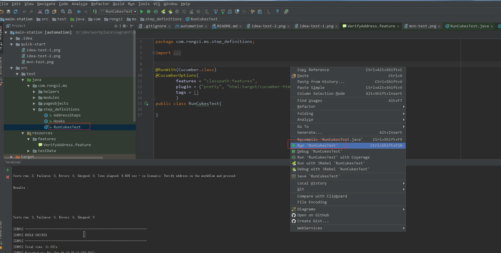
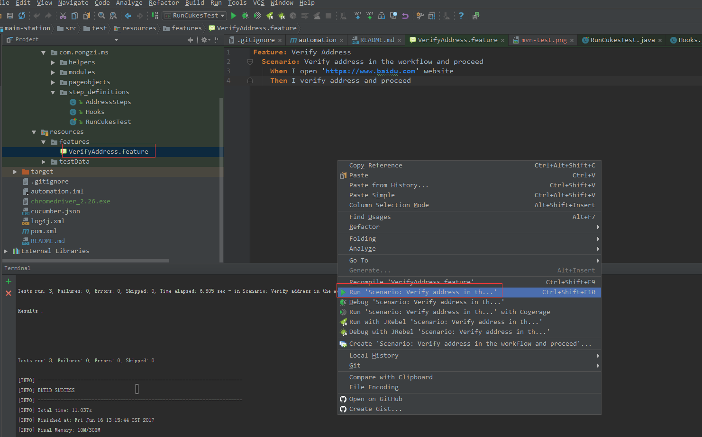

mvn# main-station automation

## index

[cucumber-jvm](https://cucumber.io/)

[selenium](http://www.seleniumframework.com/)

## examples

[CucumberJVMExamples](https://github.com/machzqcq/CucumberJVMExamples)

[cucumber-jvm](https://github.com/cucumber/cucumber-jvm/tree/master/examples)

## Quickstart

### maven

设置 chrome web driver, `-Dwebdriver.chrome.driver=chromedriver_2.26.exe`

运行 `mvn test -Dwebdriver.chrome.driver=chromedriver_2.26.exe` 

 

### IntelliJ IDEA 

1.  右击 *RunCukesTest* 直接运行

     

2.  右击 *feature* 文件直接运行

    

生成报告 `mvn verify`, 在 *target/reports* 目录下就可以浏览生成的报告.

根据tags来过滤场景 `mvn clean test -Dwebdriver=chrome -Dcucumber.options="--tags @please_login"`